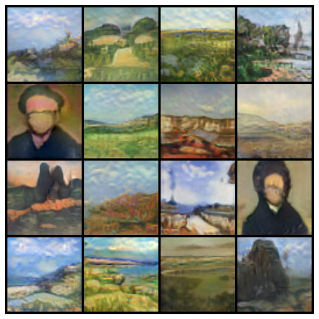

***

# StyleGAN in PyTorch: Architecture & Implementation

## Overview

This is a PyTorch implementation of the **StyleGAN** architecture, trained on the `wiki-art` dataset of predominantely landscape and potrait paintings resized to 64x64.

## Architecture Deep-Dive

### The Generator
The StyleGAN generator decouples the latent space and uses a style-based synthesis network.

* **Mapping Network (`Mapper`)**: Transforms the initial latent noise vector ($Z$) into an intermediate, disentangled latent space ($W$). This is built using a series of Fully Connected (`FC`) layers paired with a custom `PixelNorm` layer to normalize feature vectors.
* **Synthesis Network (`Synthesizer`)**: Instead of starting from noise, image generation begins from a learned **constant tensor**. 
* **Style Modulation**: The intermediate latent vector $W$ is passed through an `AffineTransform` to dictate the "styles." These styles modulate the weights of the convolutional layers (often referred to as weight demodulation).
* **Noise Injection**: Explicit, scaled Gaussian noise is injected into the feature maps after each convolution to control stochastic, localized variations in the generated images (e.g., hair placement, background textures).

### The Discriminator
* **ResNet-Style Architecture**: A progressive convolutional discriminator built with custom downsampling blocks to evaluate images from high to low resolutions.
* **Minibatch Standard Deviation**: Implemented near the end of the discriminator network. This layer calculates the standard deviation of features across the entire batch and feeds it as a new feature map, encouraging the generator to produce a diverse variety of images and explicitly combatting mode collapse.

## Training Techniques

To stabilize training and achieve high-quality image generation, this implementation incorporates several training techniques:

* **Initializing Weights**: Linear (`FC`) and convolutional (`Conv`) layers are initialized with a standard normal distribution.
* **Lazy R1 Regularization**: Applied exclusively to the discriminator. It heavily penalizes the gradient on real data periodically (every 16 batches) to stabilize the discriminator's gradients without slowing down overall training.
* **Exponential Moving Average (EMA)**: The project maintains a separate, continuously updated EMA copy of the generator's weights. This EMA model is used for inference and intermediate visualization, yielding significantly smoother and higher-fidelity images than the raw training weights.
* **Latent Space Truncation**: Supports the "truncation trick" in the $W$ space, interpolating between a specific latent vector and the moving average of all latent vectors to balance image fidelity against diversity.

## Notebook Structure

The notebook includes:

* **`StyleGAN`**: The main wrapper class orchestrating the networks, Adam optimizers, dynamic tracking, and the custom training loop.
* **`Generator`, `Mapper`, `Synthesizer`**: The hierarchical components of the generation pipeline.
* **`Discriminator`, `DiscriminatorBlock`**: The adversary components.
* **`ConvBlock`, `Conv`, `FC`, `PixelNorm`, `AffineTransform`**: Custom low-level PyTorch `nn.Module` classes managing weight scaling, normalization, and affine transformations.
